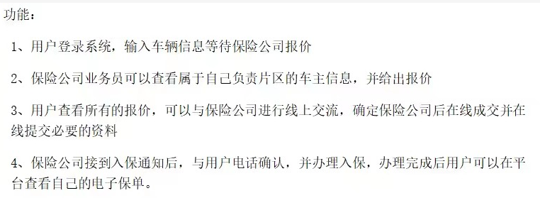
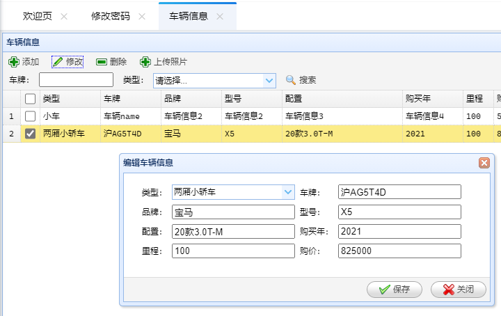
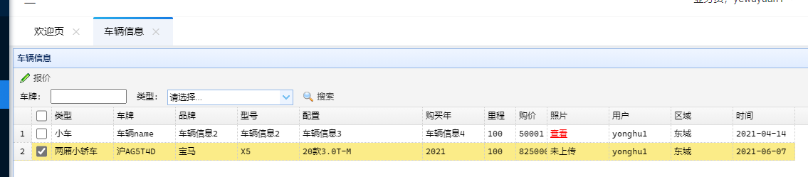
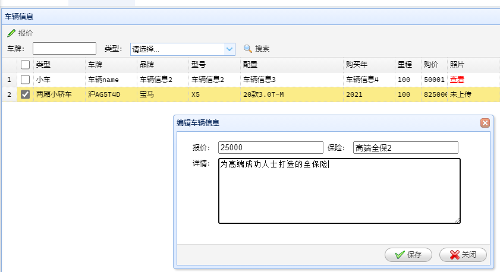
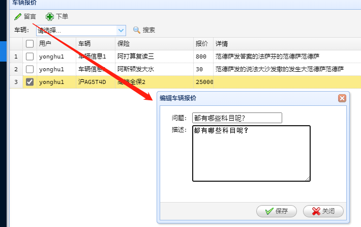
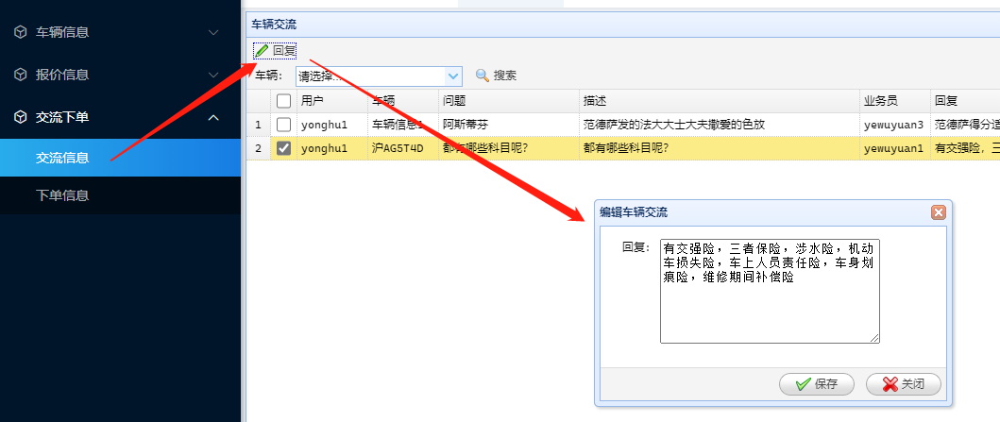
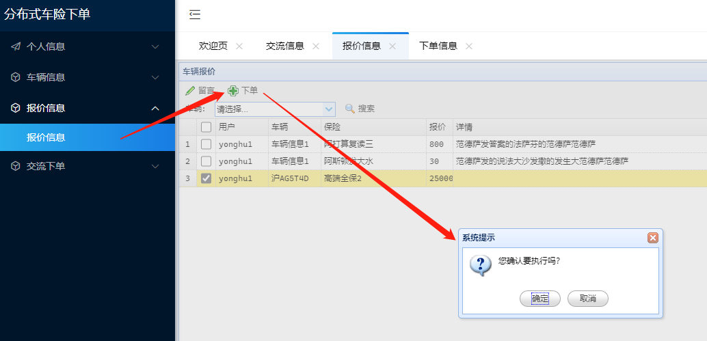

## requirement

1. 用户登录系统，输入车辆信息等待保险公司报价
2. 保险公司业务员可以查看属于自己负责的区域的车主信息，并给出报价
3. 用户查看所有报价，可以和保险公司进行线上交流，确定保险公司后下线成交并在线提交必要的资料
4. 保险公司接到入保通知单后，与用户电话确认，并办理入保，办理完成后用户可以在平台查看自己的电子保单

### 1.0 用户登录系统

### 1.1 录入车辆信息

### 2.0 保险业务员登录

### 2.1 根据所属区域，看到车主的车辆信息

### 2.2 给出报价

### 3.0 用户（需要登录）通过报价信息，与保险公司线上交流

### 3.1 业务员（需要登录）查看到交流信息，给出反馈

### 3.2 线上下单

